# The Tidy Suite

Thirteen friendly apps that run in your web browser. No install, no account. Download one file, double-click it, and you're working. Everything saves on your own computer.

| App | What it does | Open it |
|---|---|---|
| **Tidy** | Spreadsheets: budgets, lists, anything with rows and columns | [`tidy/tidy.html`](tidy/tidy.html) |
| **Neat** | Writing: letters, notes, reports, with a helper that tells you how easy it reads | [`neat/neat.html`](neat/neat.html) |
| **Spruce** | Slides: build a talk, present it, save it as PowerPoint | [`spruce/spruce.html`](spruce/spruce.html) |
| **Steady** | Bills: a plan for every bill, a debt-free date, and progress you can see | [`steady/steady.html`](steady/steady.html) |
| **Clearout** | Selling: price your stuff, write the listing, handle buyers, offer local services, track every sale | [`clearout/clearout.html`](clearout/clearout.html) |
| **Handy** | Side income: offer local services, price yourself, find customers, track jobs and debt paid down | [`handy/handy.html`](handy/handy.html) |
| **Sorted** | Repairs: step-by-step troubleshooting for engines, vehicles, HVAC and appliances, plus what to bill, flip price and cost to own | [`sorted/sorted.html`](sorted/sorted.html) |
| **Hearty** | Meals: plan a week of food you'll enjoy, one shopping list, food and gas budget, and what you keep by skipping the drive-thru | [`hearty/hearty.html`](hearty/hearty.html) |
| **Ready** | Calendar and to-dos: the next 14 days, a month calendar, and dates pulled in from Steady, Handy, Stocked, Polished and Chipper | [`ready/ready.html`](ready/ready.html) |
| **Stocked** | Home inventory: photos, what you paid, what it's worth today, warranties, and a printable insurance list | [`stocked/stocked.html`](stocked/stocked.html) |
| **Polished** | Job hunt: resume builder, cover letters, interview practice, and a tracker for every job you go after | [`polished/polished.html`](polished/polished.html) |
| **Chipper** | Chores and allowance: a tap-to-check chore chart, save/spend/give jars, and savings goals for kids | [`chipper/chipper.html`](chipper/chipper.html) |
| **Snug** | Backup: one file saves your work from every app, and brings it back on a new computer | [`snug/snug.html`](snug/snug.html) |

Open `index.html` for the suite home page. It has a menu of every app grouped by part of life, a description of each one, an **Open** button, and a live status line ("3 bills tracked", "Last backup 2 days ago") read from what's saved on this computer. It also reminds you when it's time to back up.

They work together. Copy cells from Tidy and paste them into Neat or Spruce as a table. Open a Neat document in Spruce and each heading becomes a slide. Export your bills from Steady as a CSV and open them in Tidy. Need money for those bills? Clearout helps you sell what you don't use, and Handy helps you earn with your time and skills. Fixing something to sell or for a customer? Sorted walks you through the repair and tells you what to charge. Trying to stretch the food budget? Hearty plans your meals and shopping trip, and its weekly total pairs with the groceries line in Steady. Ready gathers the dates from every app into one calendar, Stocked keeps the list your insurance company will ask for, Polished helps you land a job, Chipper teaches the kids about money, and Snug keeps a backup of all of it.

Keep all the app folders together and open them in the same browser. That's how Ready, Snug and the home page can see what the other apps saved.

## Run it at localhost or on your home network

Double-click **`Start Tidy Suite.bat`**. A small window opens and your browser goes to **http://localhost:8765**, the suite home page. Every app runs from that one address. Leave the window open while you use the apps, and close it to stop.

The window also shows a network address like `http://192.168.1.20:8765`. Phones, tablets and other computers on the same Wi-Fi can open that address to use the suite. The first time, Windows may ask whether to allow PowerShell on your network: allow it on **Private networks**. To keep the suite on this computer only, run `Start Tidy Suite.ps1 -LocalOnly`.

It uses PowerShell, which comes with Windows, so there is nothing to install. It only serves files from the Tidy Suite folder, and never the launcher itself.

## People

Every app has a small **people button** in the bottom corner. Tap it to pick who's using the suite, add a person, rename, or remove someone. Each person's work is saved separately, so on a shared computer nobody's bills, chores or resume get mixed up with anyone else's. Switching people switches every open suite app. Snug backs up and restores the person who is picked.

Work is saved in the browser on each device, so a phone and a computer each keep their own. The first person keeps everything saved before people were added. The picker keeps work tidy and separate. It isn't a password lock.

Moving your work over to localhost: apps opened at localhost save separately from apps opened by double-clicking the files. Open Snug the old way and save a backup file, then open Snug at localhost and restore it. After that, stick with one way and one port (8765).

## Tidy

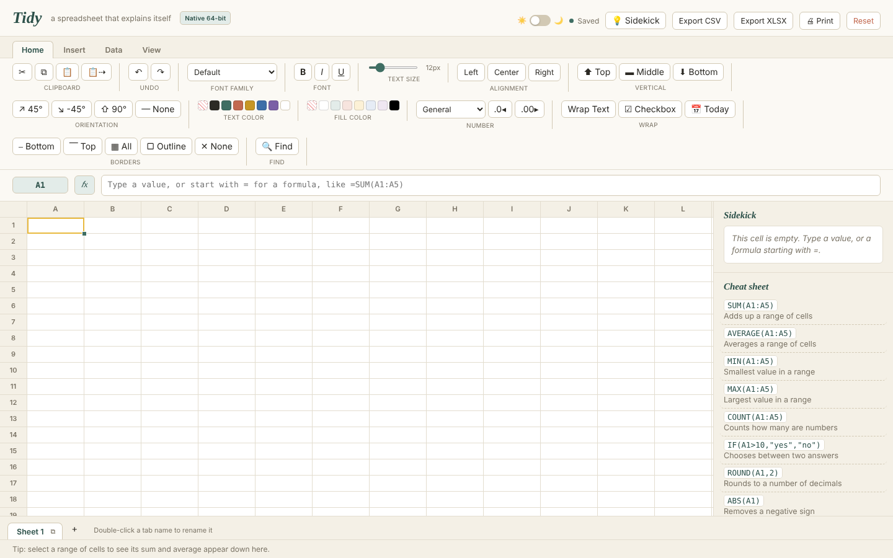

A spreadsheet that stays out of your way. Formulas, charts and printing. The manual is in [`tidy/tidy-manual.pdf`](tidy/tidy-manual.pdf).

## Neat

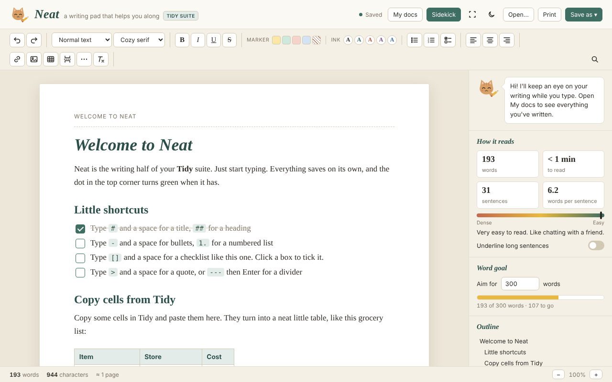

A writing pad. Markdown-style shortcuts, checklists, highlighters, word goals, find and replace, and printing. The Sidekick panel shows how easy your writing is to read. Saves as Word, web page, Markdown or plain text.

## Spruce

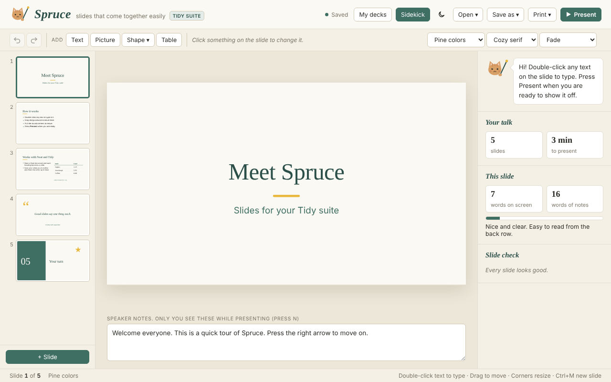

Slides that come together easily. Layouts, themes, pictures, shapes, tables and speaker notes. Presents full screen with a timer. Prints slides, notes pages or handouts, and saves as PowerPoint or a slideshow web page.

## Steady

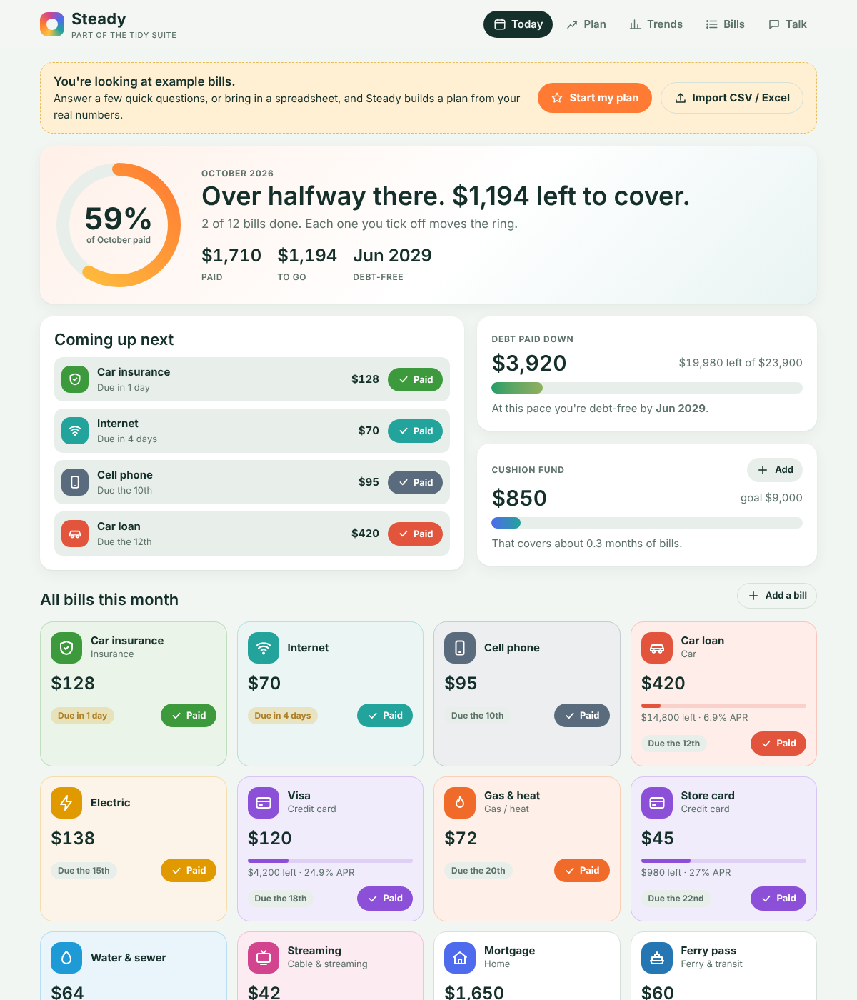

A bill tracker that gives you hope and a plan. Use as much or as little as you like: the first question asks what you'd like help with, and just bills is perfectly fine.

- **Start my plan** asks a few easy questions: what you'd like help with, your income, which bills you have, and what a win looks like to you.
- **Bring your bills in** from email or a spreadsheet. Paste a bill email or open saved emails (.eml or a mailbox export) from any provider, and Steady fills in the bill, amount, due date, and for cards the balance and interest rate. Inside Claude it can also scan Gmail directly. You check everything before it's saved.
- **Monthly or not.** Bills can be monthly, every 3 or 6 months, or yearly (like flood insurance), and Steady shows what to set aside each month.
- **Today** shows a progress ring for the month and a colorful tile for every bill. Tap **Paid** and watch the ring fill.
- **Mortgage breakdown** shows where the payment goes (principal and interest, taxes, insurance, PMI), how much equity you have, and when you can ask your lender to drop PMI.
- **Everyday spending** (optional) covers the money that isn't a bill: groceries and fuel by the week, plus eating out, household, pets, kids and kids' allowance, tobacco and vape, drinks, car upkeep, boat and recreation, club dues, gifts and more.
- **Upkeep** (optional) reminds you about checkups, car care, home upkeep and papers & renewals. When something comes due it asks if you've done it; say "not yet", pick a reason, and it checks back later. Car service dates follow how much you actually drive. Big home items (roof, windows, siding, deck, driveway, furnace, AC, water heater) just need the year they went in and how they're holding up, and Steady tells you roughly how many years are left and what to save each month. Papers & renewals (driver's license, plate tags, passport, CPL, boat registration, fishing and hunting license) only keep the expiration date, never ID numbers.
- **Paper files**: print matching folder tabs for a filing cabinet, one for each bill plus home, car, medical and everyday folders.
- **Plan** gives your debt-free date, how much interest you save compared with paying minimums only, which debt to pay first, and a paycheck-by-paycheck split.
- **Trends** charts your debt going down and weekly spending, and points out what changed and why.
- **Talk** lets you tell Steady things in plain words, like "I paid the electric, it was 142" or "spent 86 on groceries". It can read its replies out loud.

When you open `steady.html` from your computer, everything works and saves in that browser, including reading pasted or saved emails. Only the Gmail scan and the smarter chat need Claude.

Steady does the math with the numbers you give it. It's not financial advice.

## Clearout

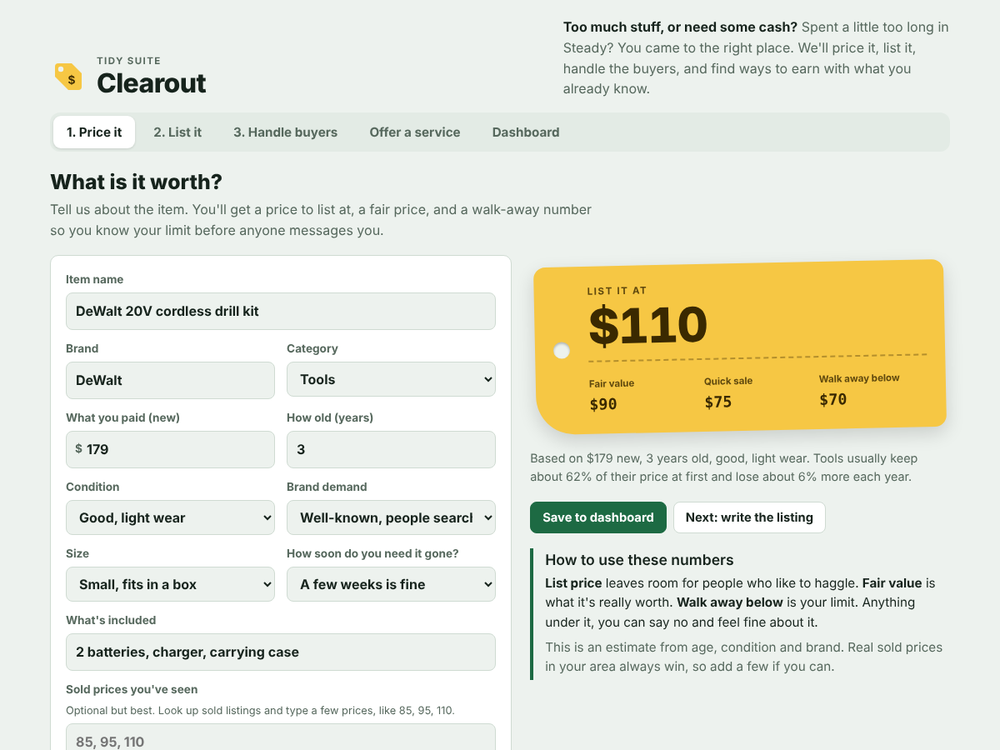

For people with too much stuff who want to turn it into money. It takes the stress out of selling.

- **Price it** gives you three numbers for any item: a price to list at, its fair value, and a walk-away price so you know your limit before anyone messages you. Add a few sold prices you've seen and it leans on those.
- **List it** writes a title and description that explain the price, and ranks Facebook Marketplace, Craigslist, Nextdoor, eBay and more for that item.
- **Handle buyers** checks any offer (take it, counter, or pass) and gives you a reply to copy. A quick checklist tells genuine buyers from resellers, time-wasters and scams. Real buyers can get a small discount; lowballers get a polite no.
- **Offer a service** turns what you have (a truck, tools, a mower, computer skills) into local service ideas with starting prices, works out your hourly rate from what you need each month, and writes your posts, quotes and thank-you messages.
- **Dashboard** checks in on each item: "Did it sell?" Say yes, enter the price, and a bell rings. Say not yet, pick what happened, and it suggests a fix like a lower price, a different site, or a fresh relist. Every sale goes into Your wins, and it shows which site makes you the most.

Prices are estimates. Real sold prices near you are always better.

## Handy

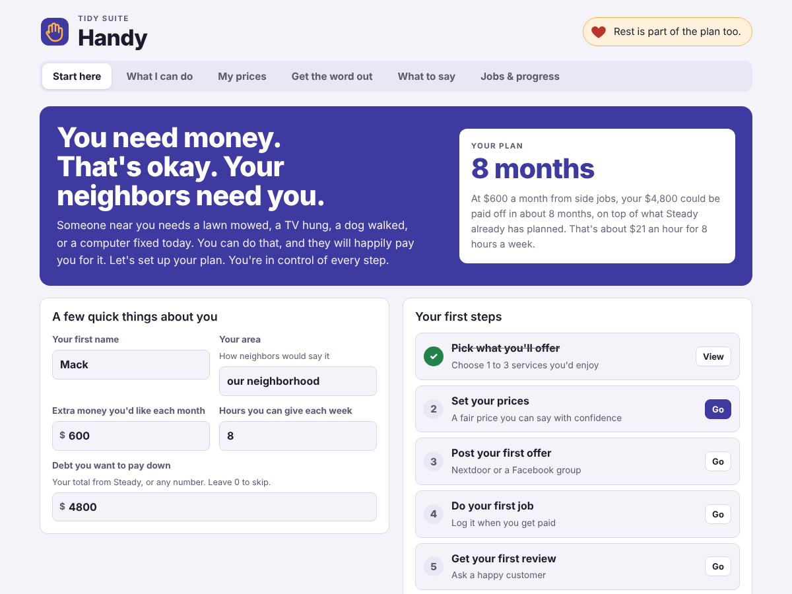

You need money. That's okay. Your neighbors need you. Handy helps you turn what you already know and own into side income, with a lot of encouragement along the way.

- **Start here** asks your goal for the month, the hours you can give, and the debt you want to pay down (your total from Steady works great). It shows how many months to pay it off and walks you through five first steps.
- **What I can do**: tap your tools and skills to see 27 local services with starting prices. Heart the ones you'd enjoy (if you enjoy it, it's not work) and pick the ones to offer.
- **My prices** works out the hourly rate you need, lets you set each price, and tells you if it meets your goal. Includes pricing tips and what to say when someone asks for cheaper.
- **Get the word out** covers Nextdoor, Facebook groups, Marketplace, flyers and word of mouth, writes your post in a friendly, professional or flyer style, and gives you an easy week plan.
- **What to say** has 13 ready messages: first reply, quotes, saying no, confirmations, running late, payment, reviews, referrals, regulars and raising prices.
- **Jobs & progress**: log each paid job and a bell rings. A ring fills toward your monthly goal, a bar shows debt paid down, and it tracks your hourly rate, reviews and repeat customers.

## Sorted

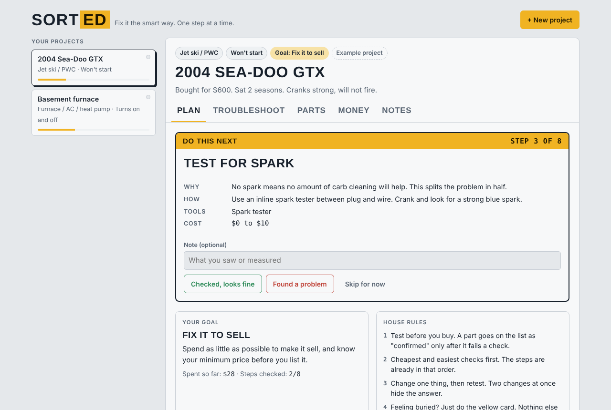

Fix it the smart way, one step at a time. For the jet ski that won't start, the mower that dies, the furnace that keeps shutting off, or the washer that won't drain. Sorted keeps you from replacing parts you don't need and from getting buried when you don't know where to start.

- **New project** asks three things: what you're working on (jet ski, car or truck, 4-wheeler, lawn mower, motorcycle, boat, snowblower, chainsaw, generator, furnace or AC, water heater, washer or dryer, fridge, dishwasher, or another appliance), your goal, and what it's doing.
- **Your goal** shapes the whole project: enjoy it yourself, fix it for someone for money, fix it to sell, or sell it as-is.
- **Do this next** shows one step at a time, cheapest and easiest checks first. Each step says why, how, what tools you need and what it costs. Mark it fine, found a problem, or skip. A found problem tells you what it points to and can add the part to your list.
- **Troubleshoot** shows the full checklist with your notes and what you've ruled out.
- **Parts** keeps a list of what you need and what you bought. Anything that hasn't failed a test is marked "not confirmed yet" so you test before you buy.
- **Money** has four calculators: **What to bill** (labor, parts markup, shop supplies, and a quote to copy for your customer), **Flip price** (list price, break-even floor and what you earn per hour), **Sell as-is?** (which nets more: selling now or fixing first), and **Cost to own** (yearly upkeep, cost per use, and repair-or-replace for appliances).
- **Notes** logs everything you checked and found, with dates.

Safety notes are built in: gas smell, AC capacitors, and refrigerant work that needs a licensed tech. Two example projects (a Sea-Doo flip and a furnace) show how it works.

## Hearty

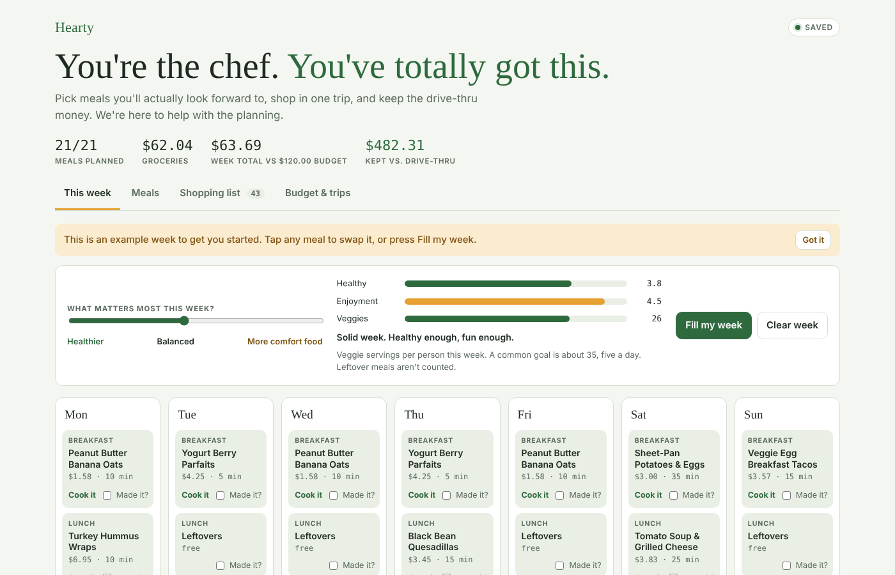

You're the chef. You've totally got this. Hearty helps you choose meals, shop in one trip, and stay away from fast food for your health and your wallet.

- **This week** lays out breakfast, lunch and dinner for seven days. A slider sets what matters most, from healthier to more comfort food, and **Fill my week** plans meals that share ingredients so less goes to waste. Meters show how healthy and enjoyable the week is and how many veggie servings it has.
- **Meals** has 18 starter recipes with cost per plate, time, and health and enjoyment ratings. **Cook mode** shows big, simple steps scaled to your household, with a tip and some encouragement. Add your own family favorites too.
- **Shopping list** builds itself from your plan, in the order most stores are laid out. Mark what you already have at home, type your store's real price over any estimate, and copy the list to your phone.
- **Budget & trips** compares groceries, gas and treats with your weekly budget, works out gas per trip from your miles, MPG and gas price, and shows what one planned trip saves over several quick runs.
- **You vs. the drive-thru** shows what you keep this week and over a year. Tick **Made it?** on each meal you cook to count real savings.
- **Planned treat out** lets you budget an eating-out night on purpose, so skipping the others feels easy.

Prices are typical estimates. Your store's prices are always better, and Hearty remembers the ones you type in.

## Ready

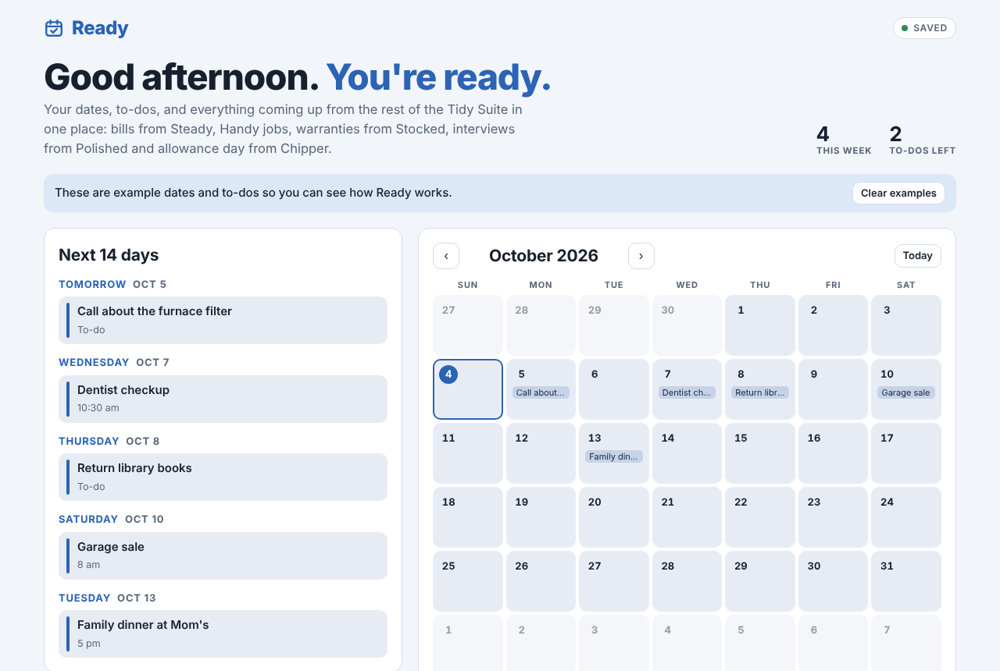

Here's what's coming. You're ready. One calendar for your own dates and everything the rest of the suite knows about.

- **Next 14 days** lists what's coming, day by day, with Today and Tomorrow called out.
- **Month calendar** shows every date in color by app. Tap a day to see it or add something.
- **To-do list** with optional due dates. Overdue items turn red so nothing slips.
- **Show dates from** pulls in Steady bill due dates and renewals, Handy jobs, Stocked warranty end dates, Polished follow-ups and interviews, and Chipper's allowance day. Ready only reads them; it never changes the other apps.

## Stocked

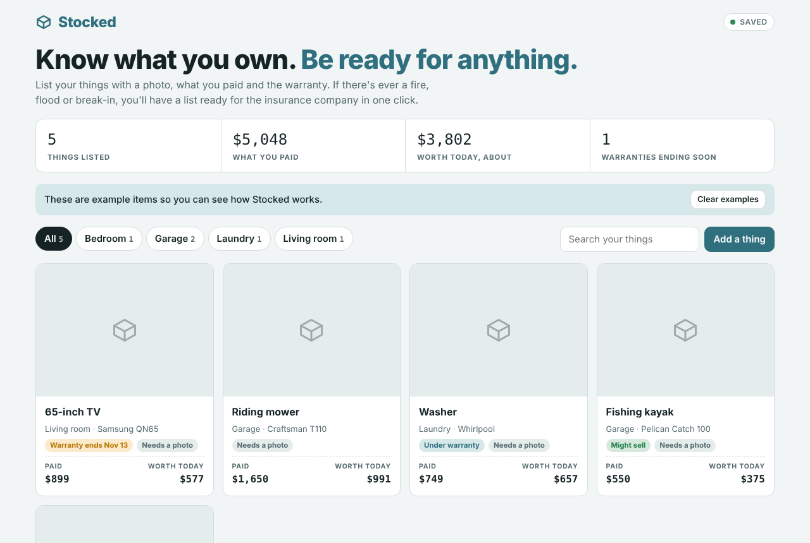

Know what you own. List your things room by room so a fire, flood or break-in claim takes minutes instead of weeks.

- **Add a thing** with a photo (shrunk automatically to save room), room, type, brand and model, serial number, when you got it, what you paid, how many, and when the warranty ends.
- **Worth today** gives a rough value based on age and type of item, so you know what to insure. Jewelry and collectibles keep their value.
- **Rooms and search** to find anything fast. Cards flag missing photos, warranties ending within 90 days, and things you might sell with Clearout.
- **Print insurance list** prints a clean table with photos and totals. **Save as spreadsheet** makes a CSV you can open in Tidy.

## Polished

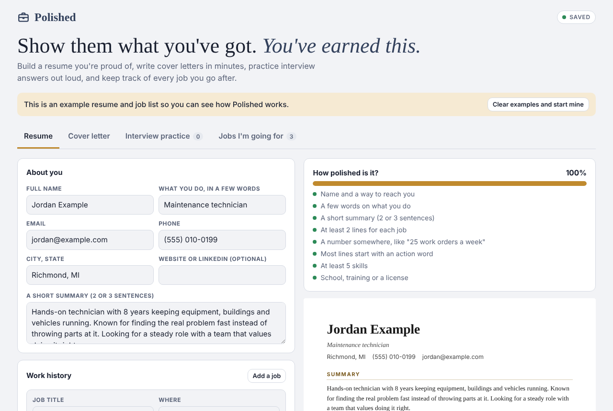

Show them what you've got. Everything you need to go after a job, in one place.

- **Resume** builds as you type, with a live paper preview. A checklist shows how polished it is (a summary, two lines per job, numbers, action words, five skills) and a row of strong starting words you can click to add. Print it or save as PDF.
- **Cover letter** writes a first draft from your resume and a couple of honest sentences about the job. Edit every word, then print or copy it.
- **Interview practice** has 12 common questions, each with a tip. Story questions get four boxes (the situation, what you had to do, what you did, how it turned out). A two-minute timer helps you practice out loud.
- **Jobs I'm going for** tracks each company, where it stands (want to apply, applied, interview, offer), and the next step and date. Those dates show up in Ready.

## Chipper

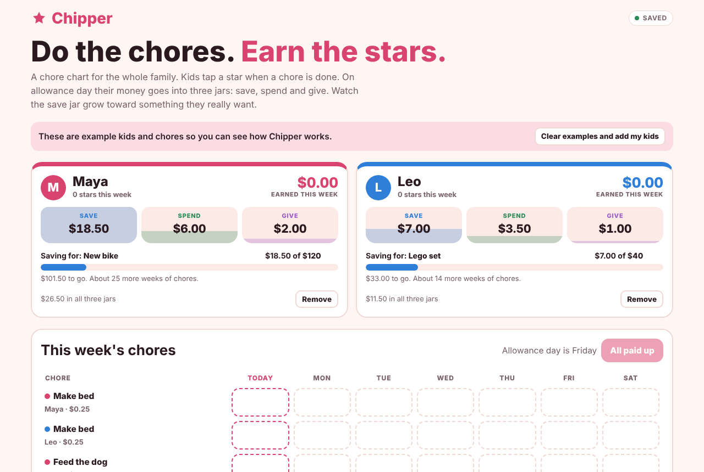

Do the chores. Earn the stars. A fridge chore chart that teaches kids about money.

- **Kids** each get a color, a running total for the week, and three jars: save, spend and give. Tap a jar to add money or take some out.
- **Savings goals** show how close each kid is and about how many weeks of chores to go.
- **This week's chores** is a big tap-to-check board. Each star is a little celebration.
- **Pay allowance** splits what each kid earned into the jars (50/40/10 by default, and you can change it) and keeps a money history.
- Set the chores, who does them, what they're worth and which days, and pick your allowance day. Allowance day shows up in Ready.

## Snug

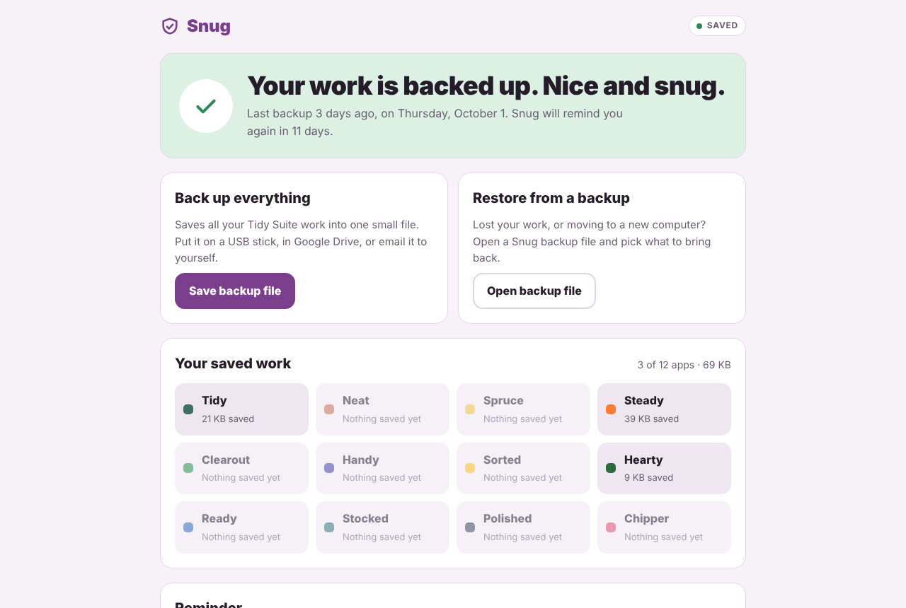

Keep your work safe. The apps save in your web browser, and clearing browser data, switching browsers or a computer problem can erase that. Snug keeps a copy somewhere else.

- **Save backup file** puts all your work from every Tidy Suite app into one small file. Keep it on a USB stick, in a cloud drive, or email it to yourself.
- **Restore** opens a backup file, shows which apps are in it, and lets you pick what to bring back. Snug keeps a copy of what was there first, so you can undo a restore.
- **Your saved work** shows which apps have work saved on this computer and how much.
- **Reminder** tells you (and the suite home page) when it's time for a fresh backup.

---
Made by hardwaremack.
